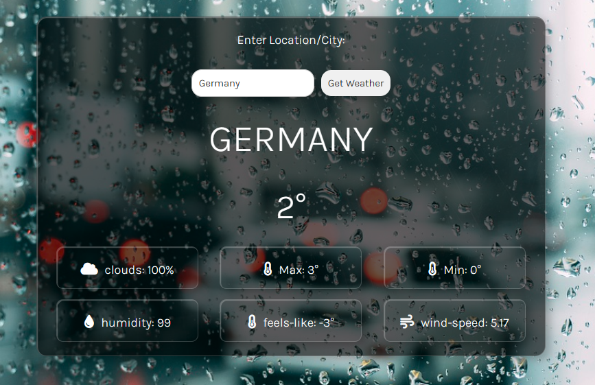

# Weather App 
The Weather App is a React-based web application that displays weather information for a specified city. It utilizes an external weather API to fetch real-time data and dynamically adjusts its background based on the temperature.



## Installation

Follow these steps to set up and run the Weather App project locally:

1. **Clone the repository:**
   ```bash
   git clone https://github.com/your-username/Weather-app.git

2. **Navigate to Project Directory:**
 cd Weather-app

3. **Install dependencies:**
npm install

4. **Run the development server:**
npm run dev

5.**Open in Browser**
Open your browser and go to http://localhost:3000 to view the Weather App.

## Requirements
Make sure you have Node.js and npm installed on your system.

This set of instructions assumes you are using npm as your package manager. If you use yarn, replace npm with yarn in the commands.

## Configuration
To use the Weather App component, you need to obtain an API key from API-Ninjas and configure it in the component.
const apiKey = import.meta.env.VITE_API_KEY;

## Technologies Used
- React
- JavaScript (ES6+)
- CSS
- HTML


